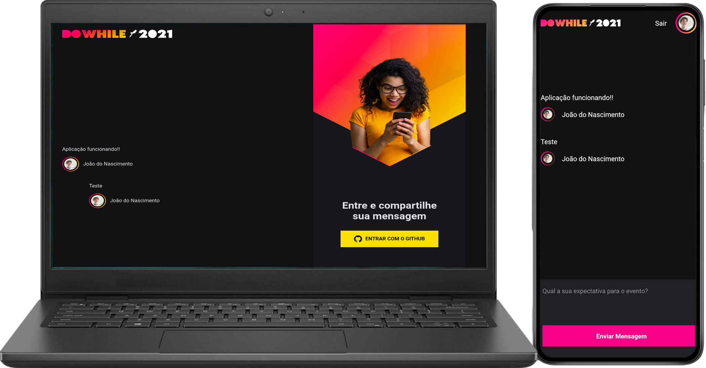

 <h1 align = "center">
🔋🚀 NLW Heat
</h1>

 

    
    
 
 

Project developed at <i><b>"The next level week Heat"</b></i>

## 🏁 Objetive

Develop a project mobile, web with backend in one week.

## 💻 This project was developed with:

- Axios
- Typescript
- Socket.io

### [Backend](./backend)

- Node.js
- Express
- Prisma
- Json Web Token

### [Web](./web)

- React
- Sass
- Vite

### [Mobile](./mobile)

- React Native
- Expo
- Moti

## 📝 Mit license

More details: [License](/LICENSE)

## 🎬 Credits

["Next Level Week - Heat"](https://nextlevelweek.com) event promoted by [@Rocketseat](https://github.com/Rocketseat).

---

 💻 Developed by João Augusto do Nascimento 🚀
